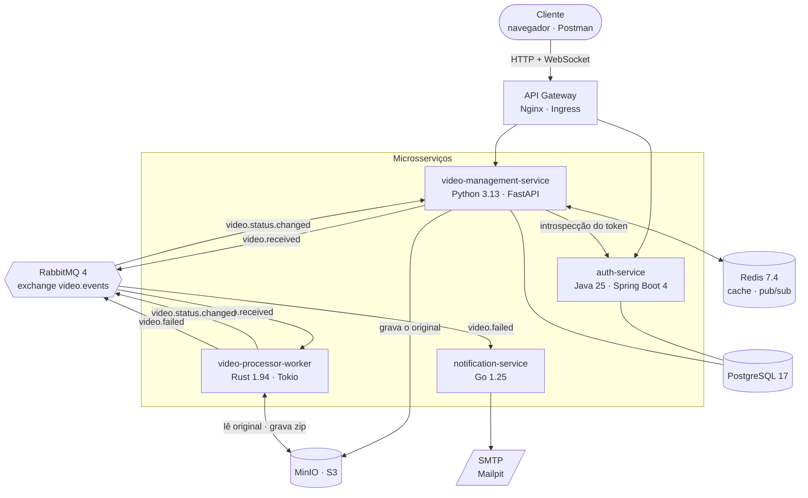
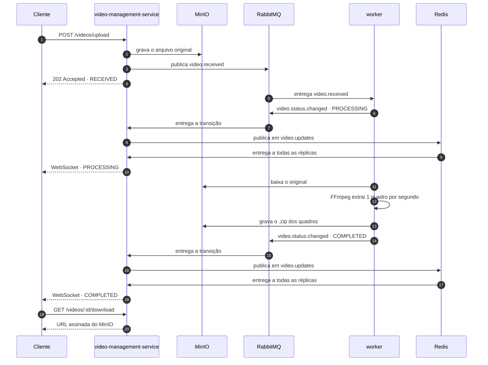

# fiapx-platform

Repositório central do **FIAP X**: infraestrutura de desenvolvimento local, manifestos de
Kubernetes, contrato de eventos e topologia do barramento compartilhados por todos os
microsserviços.

> **Comece por aqui.** Este é o único repositório que sobe o sistema inteiro. Os outros
> quatro contêm um microsserviço cada e dependem do que está declarado aqui.

## Repositórios do projeto

| Repositório | Linguagem | Papel |
| :--- | :--- | :--- |
| **fiapx-platform** *(você está aqui)* | — | Compose, Kubernetes, contratos, topologia do broker |
| [fiapx-auth-service](https://github.com/rodolfomedeiros/fiapx-auth-service) | Java 25 · Spring Boot 4 | Cadastro, login, emissão e introspecção de JWT |
| [fiapx-video-management-service](https://github.com/rodolfomedeiros/fiapx-video-management-service) | Python 3.13 · FastAPI | Upload, listagem, download e WebSocket de tempo real |
| [fiapx-video-processor-worker](https://github.com/rodolfomedeiros/fiapx-video-processor-worker) | Rust 1.94 · Tokio | Extração de quadros com FFmpeg e compactação em `.zip` |
| [fiapx-notification-service](https://github.com/rodolfomedeiros/fiapx-notification-service) | Go 1.25 | Consumo da DLQ e envio de e-mail de falha |

Para rodar localmente, os cinco repositórios precisam estar clonados **lado a lado**, porque
o `docker-compose.yml` referencia os serviços por caminho relativo (`../fiapx-auth-service`):

```
fiapx-imax/
├── fiapx-platform/                    ← docker compose up aqui
├── fiapx-auth-service/
├── fiapx-video-management-service/
├── fiapx-video-processor-worker/
└── fiapx-notification-service/
```

## Arquitetura



Os quatro serviços expõem métricas, raspadas pelo Prometheus e apresentadas em um dashboard
provisionado no Grafana.

## Fluxo de um vídeo, do upload ao download



O passo do Redis é o que torna o WebSocket correto com mais de uma réplica: só **uma**
instância consome cada mensagem da fila, mas o usuário pode estar conectado a qualquer
outra.

Em caso de falha, o worker republica em `video.received` com `attempt` incrementado,
esperando 1s, 2s e 4s. Esgotadas as três tentativas, marca `ERROR` e emite `video.failed`,
que o notification-service converte em e-mail.

## Subindo com Docker Compose

```sh
docker compose up --build
```

| Serviço | Endereço | Credenciais |
| :--- | :--- | :--- |
| API (Nginx) | http://localhost:8080 | — |
| Swagger | http://localhost:8080/docs | — |
| RabbitMQ | http://localhost:15672 | `fiapx` / `fiapx` |
| MinIO | http://localhost:9001 | `fiapx` / `fiapx-minio-password` |
| Mailpit | http://localhost:8025 | — |
| Prometheus | http://localhost:9090 | — |
| Grafana | http://localhost:3000 | `fiapx` / `fiapx` |

O dashboard **FIAP X — Processamento de vídeos** já vem provisionado no Grafana, com a
fonte de dados apontada para o Prometheus.

### Rotas públicas do gateway

| Rota | Destino |
| :--- | :--- |
| `POST /auth/register`, `POST /auth/login`, `POST /auth/introspect` | auth-service |
| `POST /videos/upload` | video-management-service |
| `GET /videos`, `GET /videos/{id}/download` | video-management-service |
| `GET /videos/ws?token=<jwt>` | WebSocket de tempo real |
| `GET /docs`, `GET /openapi.json` | Swagger do serviço de vídeos |

### Vendo o paralelismo

```sh
docker compose up -d --scale video-processor-worker=4
```

O Prometheus descobre as réplicas por DNS, então todas aparecem sem editar configuração.

## Subindo no Kubernetes

```sh
./scripts/build-images.sh     # gera fiapx/*:latest
kubectl apply -k .
```

Os manifestos vivem em [k8s/](k8s/) e são montados pelo `kustomization.yaml` da raiz — ele
fica aqui, e não dentro de `k8s/`, porque o kustomize só lê arquivos abaixo da própria raiz,
e o schema do banco e a topologia do broker moram fora de `k8s/`, compartilhados com o
Compose para que as duas formas de subir o sistema não divirjam.

| Arquivo | Conteúdo |
| :--- | :--- |
| [k8s/namespace.yaml](k8s/namespace.yaml) | Namespace `fiapx` |
| [k8s/config.yaml](k8s/config.yaml) | ConfigMap e Secret |
| [k8s/infra.yaml](k8s/infra.yaml) | Postgres, Redis, RabbitMQ, MinIO, Mailpit, volumes e probes |
| [k8s/services.yaml](k8s/services.yaml) | Os quatro microsserviços, com requests e limites |
| [k8s/autoscaling.yaml](k8s/autoscaling.yaml) | HPA do worker e da API, PodDisruptionBudgets |
| [k8s/ingress.yaml](k8s/ingress.yaml) | Roteamento equivalente ao do Nginx |

O HPA do worker precisa do metrics-server no cluster. O sinal ideal seria a profundidade de
`video-processing-queue`; enquanto o Prometheus Adapter não está instalado, a régua é CPU,
que é o recurso que a extração de quadros consome. A variante por fila está comentada em
[k8s/autoscaling.yaml](k8s/autoscaling.yaml).

O worker tem `terminationGracePeriodSeconds: 120` para terminar o vídeo em curso antes de
sair — sem isso, a mensagem voltaria à fila e o trabalho seria refeito do zero.

> O `Secret` em [k8s/config.yaml](k8s/config.yaml) tem valores de desenvolvimento. Em
> qualquer ambiente compartilhado, gere-o fora do repositório.

## Contrato de eventos

[contracts/video-event.schema.json](contracts/video-event.schema.json) é a cópia canônica do
envelope trocado entre os serviços. Cada consumidor mantém uma cópia vendorizada e um teste
que acusa divergência quando este repositório está presente no checkout — sem isso, o
checkout isolado do CI não teria como validar o contrato.

| Chave de roteamento | Publicado por | Fila de destino |
| :--- | :--- | :--- |
| `video.received` | serviço de vídeos (upload) e worker (retentativa) | `video-processing-queue` |
| `video.status.changed` | worker | `video-status-queue` |
| `video.failed` | worker (tentativas esgotadas) e o dead letter | `video-processing-dlq` |

Campos obrigatórios: `event_id`, `event_type`, `occurred_at`, `video_id`, `user_id`,
`attempt`. Os opcionais (`status`, `raw_file_path`, `zip_file_path`, `frame_count`,
`error_message`, `user_email`) são **omitidos** quando vazios, porque o schema os declara
como `string` e enviar `null` violaria o contrato.

## Topologia do broker

`rabbitmq/definitions.json` declara o exchange `video.events`, as três filas, os bindings e
o usuário. O `rabbitmq/rabbitmq.conf` é o que faz o broker realmente carregar esse arquivo
(via `load_definitions`) e o que liga as métricas por fila.

`video-processing-queue` é declarada com `x-dead-letter-exchange: video.events` e
`x-dead-letter-routing-key: video.failed`: uma mensagem rejeitada sem reenfileiramento cai
sozinha na DLQ e vira e-mail, sem que ninguém precise tratar o caso explicitamente.

Os serviços declaram as mesmas filas com os mesmos argumentos ao conectar, para funcionarem
também quando o arquivo de definições não estiver presente — divergir nos argumentos faria
o broker responder `PRECONDITION_FAILED`.

## Banco de dados

[postgres/init.sql](postgres/init.sql) cria as tabelas `users` e `videos` e o tipo
`video_status`. O mesmo arquivo é montado pelo Compose em `docker-entrypoint-initdb.d` e
publicado como ConfigMap pelo Kustomize. O script é reexecutável: o `CREATE TYPE` está
embrulhado em bloco `DO`, porque ele não aceita `IF NOT EXISTS`.

O auth-service ainda versiona `users` pelo Flyway, com `ddl-auto: validate` — a aplicação
recusa subir se o schema encontrado não corresponder ao mapeamento.

## Observabilidade

`prometheus/prometheus.yml` raspa os quatro serviços e o broker. O worker é descoberto por
DNS (`dns_sd_configs`), para que réplicas novas apareçam sem editar configuração.

| Alvo | Caminho |
| :--- | :--- |
| auth-service | `:8081/actuator/prometheus` |
| video-management-service | `:8000/metrics` |
| video-processor-worker | `:9100/metrics` |
| notification-service | `:9100/metrics` |
| RabbitMQ | `:15692/metrics` |

## CI

[.github/workflows/compose.yml](.github/workflows/compose.yml) valida `docker compose config`
e `kubectl kustomize .` a cada push, garantindo que Compose e manifestos continuam
consistentes.
